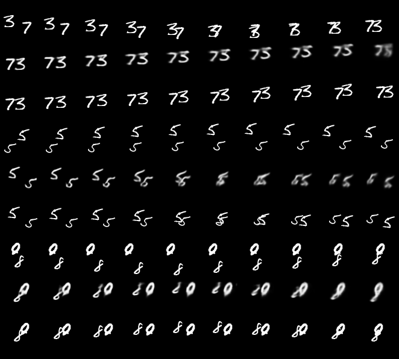

[](https://www.codacy.com/manual/andriyserdega/convlstmgru?utm_source=github.com&amp;utm_medium=referral&amp;utm_content=aserdega/convlstmgru&amp;utm_campaign=Badge_Grade)
[](https://opensource.org/licenses/MIT)
# ConvLSTM and ConvGRU | Pytorch
**Implementation of ConvolutionalLSTM and ConvolutonalGRU in PyTorch**

Inspired by [this](https://github.com/ndrplz/ConvLSTM_pytorch) repository but has been refactored and got new features such as peephole option and usage examples in implementations of video predicton seq-to-seq models on moving MNIST dataset.

## How to Use
The `ConvLSTM` and `ConvGRU` modules are inherited from `torch.nn.Module`.

ConvLSTM and ConvGRU wrappers allow using arbitrary number of layers. You can specify size of hidden dimension (number of channels) and the kernel size for each layer. In case of multiple layers and single kernel size it is being replicated for all the layers. For example, in the following snippet each of the three layers has same kernel size for each layer.

Short usage example:
```
conv_lstm_encoder = ConvLSTM(
                   input_size=(hidden_spt,hidden_spt),
                   input_dim=hidden_dim,
                   hidden_dim=lstm_dims,
                   kernel_size=(3,3),
                   num_layers=3,
                   peephole=True,
                   batchnorm=False,
                   batch_first=True,
                   activation=F.tanh
                  )
                  
hidden = conv_lstm_encoder.get_init_states(batch_size)
output, encoder_state = conv_lstm_encoder(input, hidden)
```

# Project Structure
## Main Files
- convlstm.py: contains main classes for ConvLSTMCell(represents one "layer") and ConvLSTM modules
- convgru.py : same as for convlstm
## Other
- train_gru_predictor.py and train_lstm_predictor.py: train video prediction models based on ConvGru and ConvLSTM respectively
- cnn.py: file that contains simple convolutional networks for encoding and decoding frames representations
- bouncing_mnist.py: contains dataloader that generates moving MNIST dataset from plain MNIST on a fly, use [this](https://www.dropbox.com/s/xt93tn9cstf85w1/mnist.h5?dl=0) raw MNIST dataset for reproducing the experiments.
- generate_test_set.py: used to generate testing data for trained models
- test.py: contains tester for trained models

## Prediction examples
For every 3 rows, 1st represent previous frames that are fed to the model, 2nd represent predicted frames and 3rd represent GT future frames:


